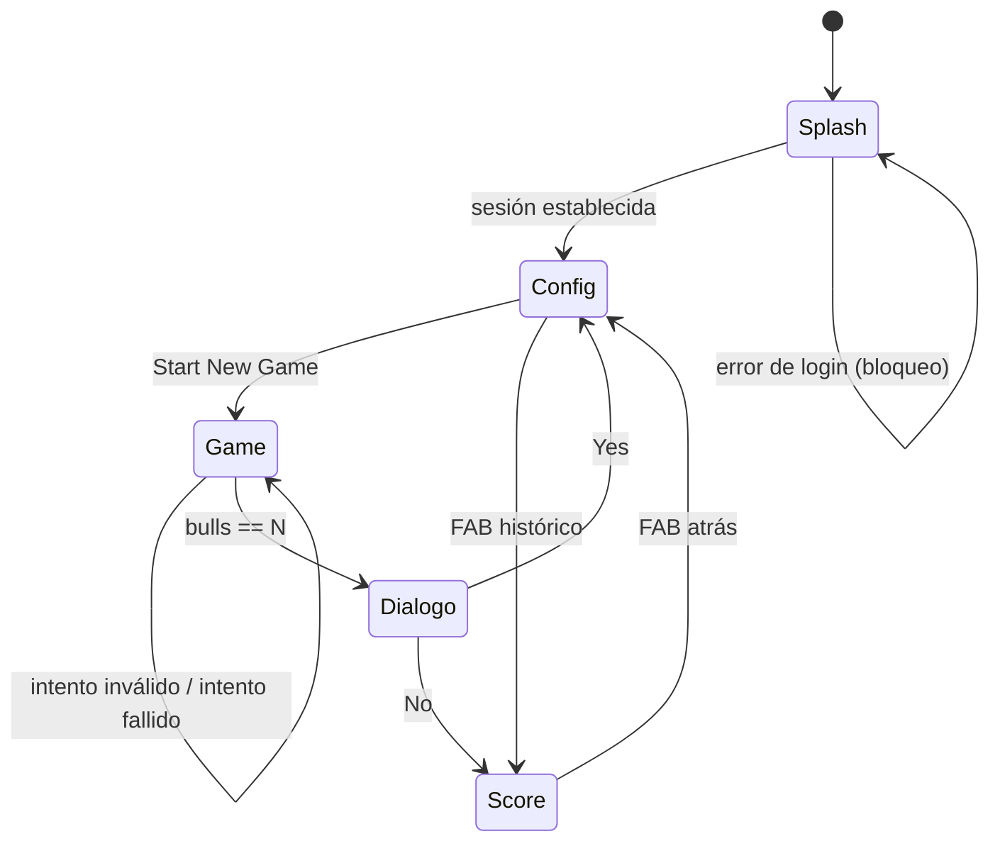

# Levantamiento funcional — Bulls and Cows

> Versión 1 · Descripción del comportamiento **actual** del código en `master` (`460b871`).
> No incluye propuestas de cambio.

---

## 1. Propósito

Implementación web del juego clásico **Bulls and Cows** (conocido también como
*Mastermind numérico* o, en España, "Toro y Vaca"). El jugador debe adivinar un
número secreto de dígitos distintos generado por el sistema, recibiendo tras
cada intento una pista cuantitativa.

La aplicación está concebida como **juego móvil de un solo jugador** contra el
sistema, con persistencia de partidas por usuario e histórico de resultados.
El manifiesto PWA (`static/manifest.json`) declara `display: fullscreen` y
`orientation: portrait`, confirmando la orientación móvil del diseño.

## 2. Actores

| Actor | Descripción |
|---|---|
| **Jugador** | Único actor humano. Se identifica con una cuenta de Google. No hay roles ni administración. |
| **Sistema** | Genera el secreto, evalúa intentos, persiste partidas. |
| **Google Identity** | Proveedor de identidad externo (único soportado). |

No existe concepto de partida compartida, multijugador, ranking global ni
interacción entre jugadores. El histórico es estrictamente personal.

## 3. Reglas de negocio

| ID | Regla |
|---|---|
| **RN-01** | El secreto se compone de `N` dígitos decimales **todos distintos entre sí**. |
| **RN-02** | `N` (el "nivel") lo elige el jugador entre 3, 4, 5 y 6. Etiquetas: Easy (3), Medium (4), Advance (5), Expert (6). |
| **RN-03** | El secreto puede empezar por `0`. Se trata como cadena de dígitos, no como número. |
| **RN-04** | Un intento es válido si **no contiene dígitos repetidos**. |
| **RN-05** | **Bull** = dígito correcto en la posición correcta. |
| **RN-06** | **Cow** = dígito presente en el secreto pero en otra posición. |
| **RN-07** | La partida se gana cuando `bulls == N`. No existe condición de derrota: no hay límite de intentos ni de tiempo. |
| **RN-08** | Los intentos inválidos **no consumen intento** (no incrementan el contador) y no se registran. |
| **RN-09** | La duración de la partida es `endDate - initDate`, medida desde la creación de la partida (selección de nivel) hasta el acierto. |
| **RN-10** | El histórico muestra las **5 últimas partidas** del jugador, ordenadas por fecha de inicio. |

### Ejemplo de evaluación

Secreto `4 7 1`:

| Intento | Bulls | Cows | Lectura |
|---|---|---|---|
| `4 2 3` | 1 | 0 | `4` acertado en su sitio |
| `1 4 7` | 0 | 3 | los tres dígitos son correctos, ninguno en su sitio |
| `4 7 1` | 3 | 0 | victoria |

## 4. Casos de uso

| ID | Caso de uso | Disparador | Resultado |
|---|---|---|---|
| **CU-01** | Autenticarse | Apertura de la aplicación | Sesión Google establecida; se deriva `userName` del email |
| **CU-02** | Configurar y empezar partida | Botón *Start New Game* | Partida creada en BD; navegación al tablero |
| **CU-03** | Componer un intento | Controles +/- de cada dígito | Intento en pantalla, no enviado |
| **CU-04** | Jugar un intento | Botón *PLAY* | Evaluación, registro y presentación de bulls/cows |
| **CU-05** | Consultar histórico | Botón flotante (libro) en Config, o *No* tras ganar | Pantalla de puntuación |
| **CU-06** | Volver a jugar | *Yes* en el diálogo de victoria, o botón flotante (atrás) en Score | Vuelta a configuración |

**No existen** como caso de uso: cerrar sesión, abandonar una partida en curso,
borrar el histórico, reanudar una partida guardada, cambiar de nivel sin
empezar de cero, ni consultar las reglas del juego dentro de la aplicación.

## 5. Requisitos funcionales por pantalla

### 5.1 Splash (`/`)

| ID | Requisito |
|---|---|
| RF-01 | Muestra un *spinner* indeterminado y el título "Bulls & Cows" mientras se resuelve la autenticación. |
| RF-02 | Al montarse, lanza **automáticamente** el login de Google mediante *popup*, solicitando los ámbitos `profile` y `email`. |
| RF-03 | Al detectarse sesión activa, almacena `uid`, `userName` (parte local del email) y `name` (display name) y navega a `/config`. |
| RF-04 | Si el login falla, el error se escribe en consola y **la pantalla queda bloqueada indefinidamente** en el spinner. No hay mensaje ni reintento. |

### 5.2 Config (`/config`)

| ID | Requisito |
|---|---|
| RF-05 | Barra superior con el título de la aplicación (común a Config, Game y Score). |
| RF-06 | Desplegable de nivel con cuatro opciones (RN-02). |
| RF-07 | *Start New Game* crea la partida en persistencia y navega a `/game/:level`. |
| RF-08 | Botón de acción flotante que navega al histórico. |

### 5.3 Game (`/game/:level`)

| ID | Requisito |
|---|---|
| RF-09 | El número de dígitos se toma del parámetro de ruta `:level`. |
| RF-10 | Lista de intentos, **el más reciente primero**, con animación de entrada. Cada fila muestra el intento con dígitos separados, un icono de doble check con el número de bulls y un icono de check simple con el de cows. |
| RF-11 | Área de composición con un selector por dígito. Cada selector tiene `+` arriba, el valor en el centro y `−` abajo. |
| RF-12 | Los selectores son **cíclicos**: `9 + 1 → 0`, `0 − 1 → 9`. |
| RF-13 | Botón *PLAY* que envía el intento compuesto. |
| RF-14 | Si el intento es inválido (RN-04) se muestra el aviso *"Move is not valid!"* en un snackbar inferior durante 2 s. |
| RF-15 | Al ganar, se cierra la partida en persistencia y se abre un diálogo modal *"You win! Would you like to play again?"* con acciones **Yes** (→ `/config`) y **No** (→ `/score`). |

### 5.4 Score (`/score`)

| ID | Requisito |
|---|---|
| RF-16 | Tarjeta destacada con la **última partida**: nivel, fecha, número de intentos y duración `mm:ss`. |
| RF-17 | Listado de las **5 últimas partidas**, cada una con nivel, fecha e intentos/duración. |
| RF-18 | Botón de acción flotante de retorno a `/config`. |

## 6. Flujo de navegación



## 7. Modelo de datos funcional

Estructura en Realtime Database, particionada por usuario:

```
/{uid}
  └── games
        └── {gameId}                (clave push generada por Firebase)
              ├── level             nivel elegido
              ├── initDate          epoch ms de creación
              ├── endDate           epoch ms de victoria (ausente si no se ganó)
              └── moves
                    └── {n}         ordinal del intento, empezando en 1
                          ├── value  intento, p. ej. "471"
                          ├── bulls
                          └── cows
```

Observaciones funcionales sobre el modelo:

- No se guarda el **secreto** de la partida. Una partida no es reproducible ni
  auditable a posteriori: no se puede verificar que los bulls/cows registrados
  fueran correctos.
- No hay estado explícito de partida. Una partida "abandonada" es simplemente
  una partida sin `endDate`, indistinguible de una partida en curso.
- No se persiste ningún perfil de usuario; sólo su `uid` como raíz del árbol.

## 8. Requisitos no funcionales observados

| Ámbito | Situación actual |
|---|---|
| **Disponibilidad** | Dependencia total de Firebase. Sin BD, la aplicación no pasa de la pantalla de login. |
| **Offline** | Manifiesto PWA presente, pero **sin service worker**. No hay capacidad offline real. |
| **Accesibilidad** | Controles basados en iconos sin etiquetas textuales ni `aria-*`. Interacción exclusivamente por click/tap: no hay entrada por teclado. |
| **i18n** | Interfaz íntegramente en inglés, cadenas embebidas en las plantillas. |
| **Rendimiento** | Irrelevante por volumen; toda la lógica de juego es cliente. |
| **Privacidad** | Se solicitan los ámbitos `profile` y `email` de Google sin consentimiento previo ni aviso. No hay política de privacidad ni mecanismo de borrado de datos. |

## 9. Brechas funcionales detectadas

Comportamientos que no cumplen la intención aparente del diseño.
*(No verificado en ejecución — derivado de lectura de código.)*

| ID | Brecha | Impacto |
|---|---|---|
| **BF-01** | **El secreto se imprime en la consola del navegador** en cada partida (`console.log(this.secret)`). | El juego es trivialmente derrotable. |
| **BF-02** | Los selectores se inicializan con valores `0,1,2,…,N−1`, no a cero. El primer intento propuesto por defecto es siempre `012…`. | Menor, pero desconcertante. |
| **BF-03** | `isValidMove` **sólo** comprueba dígitos repetidos: no valida longitud. Un intento vacío o incompleto se aceptaría. Hoy no es alcanzable desde la UI, que siempre compone `N` dígitos. | Latente. |
| **BF-04** | En la rama de intento vacío, `play()` retorna sin incrementar el contador, devolviendo el **mismo `id` que el intento anterior**. En persistencia, la clave del intento se sobrescribiría. | Latente (ligado a BF-03). |
| **BF-05** | `moves.length` se calcula sobre un objeto de Firebase, no un array → el número de intentos mostrado en el histórico es **`undefined`**. | La métrica principal del histórico no se muestra. |
| **BF-06** | La duración se calcula sin comprobar la existencia de `endDate`. Una partida abandonada produce **`NaN:NaN`** en el histórico. | Visible para cualquier usuario que abandone una partida. |
| **BF-07** | El nivel se guarda como **cadena** (`"3"`), porque el desplegable emite strings. El histórico lo muestra sin normalizar. | Cosmético; afecta a futuras consultas/filtrados. |
| **BF-08** | El nivel inicial del desplegable es `0`, valor no presente entre las opciones. Si el jugador pulsa *Start New Game* sin elegir nivel, se crea una partida de nivel 0 y se navega a `/game/0`: **tablero sin dígitos y secreto vacío**. | Ruta de fallo alcanzable en el primer uso. |
| **BF-09** | No hay forma de **cerrar sesión**. La sesión de Google persiste indefinidamente en el dispositivo. | Bloqueante en dispositivo compartido. |
| **BF-10** | El diálogo de victoria no es descartable por otra vía que sus dos botones; no hay retorno al tablero para revisar la partida ganada. | Menor. |
| **BF-11** | No existen las reglas del juego en la aplicación. Un usuario que no conozca Bulls and Cows no puede deducir el significado de los iconos de bulls y cows. | Alto para adopción. |
| **BF-12** | El histórico se recarga mediante suscripciones `on('child_added')` que **nunca se cancelan**, y la lista se invierte mutando el estado en cada reevaluación. Al entrar varias veces en Score se acumulan entradas duplicadas y el orden oscila. | Corrupción visible del histórico durante la sesión. |
| **BF-13** | La tarjeta de "última partida" captura `store.state.lastGame` **por referencia en el momento de creación** del componente; la carga posterior **reasigna** esa propiedad a un objeto nuevo, por lo que la vista sigue apuntando al objeto vacío inicial. La tarjeta destacada quedaría permanentemente en blanco. | El elemento principal de la pantalla de puntuación no muestra datos. |

## 10. Cuestiones abiertas

Decisiones de producto a resolver antes de definir la arquitectura objetivo:

1. **¿Se conserva la autenticación?** Determina si hace falta backend, base de
   datos e identidad, o si el juego puede ser 100 % estático con histórico local.
2. **¿Se conserva el histórico entre dispositivos?** Es el único requisito que
   fuerza persistencia servidor.
3. **¿Se migran datos existentes?** La BD fue eliminada: se asume que no, pero
   conviene confirmarlo explícitamente.
4. **¿Alcance funcional de la actualización?** ¿Paridad estricta con lo actual
   + corrección de brechas, o se aprovecha para añadir (reglas, i18n,
   accesibilidad, modo offline, límite de intentos, dificultad por tiempo)?
5. **¿Sigue siendo un producto móvil PWA**, o se replantea como web
   responsive convencional?
