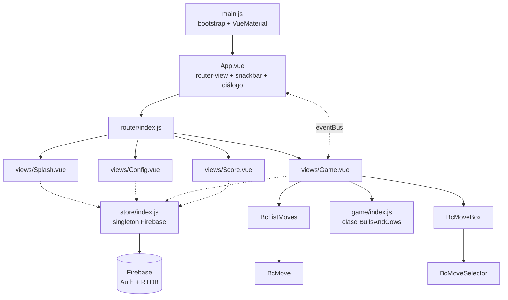

# Levantamiento técnico — Bulls and Cows

> Versión 1 · Análisis estático del código en `master` (`b2f9c52`), clonado de
> `github.com/laninog/bulls-and-cows`. Tag más reciente: `v1.0.0-alpha`.
> La aplicación **no se ha ejecutado**; no se ha intentado `npm install`.

---

## 1. Resumen

Single Page Application **Vue 2** generada con la plantilla oficial
`vuejs-templates/webpack` de 2017, con persistencia y autenticación delegadas
íntegramente en **Firebase** (Realtime Database + Auth con proveedor Google).
No hay backend propio: el cliente habla directamente con Firebase.

**Volumen:** ~1.200 líneas de código propio en 13 ficheros (`src/`). El resto
del repositorio (`build/`, `config/`, `test/`) es *scaffolding* sin modificar.

**Estado:** toda la cadena de herramientas está fuera de soporte, y la
dependencia de infraestructura (la base de datos) ya no existe. No es una
aplicación mantenible en su forma actual.

## 2. Inventario de stack

### 2.1 Dependencias de ejecución

| Paquete | Versión declarada | Rol | Estado |
|---|---|---|---|
| `vue` | ^2.5.9 | Framework | **EOL** (fin de soporte Vue 2: 31-dic-2023) |
| `vue-router` | ^2.8.1 | Enrutado | EOL con Vue 2 |
| `vue-material` | ^0.7.5 | Librería UI Material | **Abandonada**; 0.7 es anterior incluso a la rama 1.0-beta |
| `firebase` | ^4.7.0 | Auth + Realtime Database | **Obsoleta**; API *namespaced*, sustituida por la API modular en v9 (2021) |
| `vuefire` | ^1.4.4 | Binding Vue↔Firebase | **Declarada pero no importada en ningún fichero** |

### 2.2 Cadena de construcción

| Herramienta | Versión | Estado |
|---|---|---|
| webpack | ^2.6.1 | Fuera de soporte (actual: 5.x) |
| Babel | ^6.22 (`babel-core`, preset `env`, `stage-2`) | Fuera de soporte (actual: 7.x/8.x) |
| ESLint | ^4.19 + `eslint-config-standard@6` + `eslint-plugin-html` | Fuera de soporte (actual: 9.x, *flat config*) |
| Karma + Mocha + Chai + Sinon + PhantomJS | varios | **Karma deprecado (2023)**; **PhantomJS abandonado (2018)** |
| Nightwatch + Selenium + chromedriver | ^0.9.12 | Fuera de soporte (actual: 3.x) |
| `extract-text-webpack-plugin` | ^2.0.0 | Deprecado desde webpack 4 |
| Node declarado (`engines`) | `>= 4.0.0` | Node 4 EOL abril 2018 |

**Consecuencia práctica:** una instalación limpia hoy es de resultado incierto.
Varios paquetes tienen *lifecycle scripts* que compilan o descargan binarios
(`phantomjs-prebuilt`, `chromedriver`, `node-sass` indirecto) contra versiones
de Node modernas. *(No verificado en ejecución.)*

## 3. Arquitectura de la aplicación



### 3.1 Módulos

| Módulo | LOC aprox. | Responsabilidad | Valoración |
|---|---|---|---|
| `src/game/index.js` | 80 | Motor del juego: generación de secreto, validación y evaluación de intentos | **Único activo reutilizable.** Lógica pura, sin dependencias, sin estado de UI. Contiene defectos, pero es aislable y testeable |
| `src/store/index.js` | 75 | Inicialización de Firebase, estado global y acceso a datos | Singleton plano, **no reactivo**. Mezcla configuración, estado y capa de acceso a datos |
| `src/events/index.js` | 5 | Event bus global (`new Vue()`) | Antipatrón; eliminado como mecanismo en Vue 3 |
| `src/router/index.js` | 30 | 4 rutas, **sin guards** | Ver DT-09 |
| `src/views/*.vue` | 4 × ~60 | Pantallas | Acoplan presentación, orquestación y acceso a datos |
| `src/components/Bc*.vue` | 4 × ~50 | Presentación | Razonablemente cohesivos; `BcMoveBox` con un defecto de reactividad |

### 3.2 Gestión de estado

No se usa Vuex pese al nombre del directorio. El estado vive en un objeto
literal exportado (`store`) con un campo `state` y métodos que mutan
directamente. Las vistas lo importan y leen sus propiedades.

El patrón funciona por accidente en los casos en que Vue observa el objeto al
incluirlo en `data()`, y **falla cuando el store reasigna una propiedad**
(`this.state.lastGame = {...}`), porque el componente conserva la referencia
antigua. Es la causa raíz de BF-13.

### 3.3 Capa de datos

Acceso directo desde el cliente a Realtime Database mediante el SDK
*namespaced*. Las rutas se construyen por concatenación desde `state.user.uid`.

```js
this.state.db.ref(this.state.user.uid).child('games').child(key)...
```

Características relevantes:

- **Sin capa de abstracción**: la forma del árbol de RTDB está esparcida por
  el store. Cambiar de proveedor de persistencia obliga a reescribir el módulo
  completo, pero la superficie es pequeña (5 métodos).
- **Sin manejo de errores**: ninguna operación de escritura tiene `.catch`.
  Un fallo de red o de reglas es silencioso.
- **Suscripciones sin cancelar**: `on('child_added')` sin `off()` (BF-12).
- **Sin control de concurrencia ni transacciones.** No se necesita aquí, pero
  conviene anotarlo.

## 4. Seguridad

| ID | Hallazgo | Severidad |
|---|---|---|
| **SEC-01** | **Configuración de Firebase embebida en el código fuente** y versionada en un repositorio público (`apiKey`, `projectId`, `databaseURL`, `messagingSenderId`, `storageBucket`). En Firebase Web la `apiKey` no es un secreto por diseño, pero identifica el proyecto y su superficie expuesta. | Media |
| **SEC-02** | **Las reglas de seguridad de RTDB no están en el repositorio**, ni ningún `firebase.json` / `.firebaserc`. No hay forma de auditar ni reproducir la postura de autorización. Es el control que realmente protege los datos, y está fuera de control de versiones. | **Alta** |
| **SEC-03** | **El secreto de la partida se emite por consola** (`console.log`) y, además, reside en memoria del cliente. La lógica de juego es enteramente cliente: no hay servidor de confianza. Cualquier puntuación del histórico es, por construcción, no verificable. | Alta (integridad del dominio) |
| **SEC-04** | **`package-lock.json` está en `.gitignore`.** Las construcciones no son reproducibles y no existe base para un SBOM ni para escaneo de dependencias. | **Alta** |
| **SEC-05** | Sin CI, sin escaneo de dependencias (SCA), sin SAST, sin SBOM, sin gestión de vulnerabilidades. El árbol de dependencias de 2017 acumula años de CVEs no evaluados. | **Alta** |
| **SEC-06** | `index.html` carga hojas de estilo de `fonts.googleapis.com` con **URL relativa al protocolo** (`//`) y **sin SRI**. Además implica transferencia de IP del usuario a un tercero sin base de consentimiento. | Media |
| **SEC-07** | **Sin Content-Security-Policy** ni cabeceras de seguridad (no hay configuración de servidor en el repositorio). | Media |
| **SEC-08** | `productionSourceMap: true`: los *source maps* se publican en producción, exponiendo el código fuente original. | Baja |
| **SEC-09** | Autenticación mediante *popup* disparada automáticamente al cargar, sin acción del usuario, solicitando ámbitos `profile` y `email`. Bloqueada por defecto en varios navegadores y cuestionable en términos de consentimiento. | Media |
| **SEC-10** | Sin cierre de sesión, sin expiración gestionada, sin borrado de datos del usuario (derecho de supresión). | Media |

## 5. Calidad y pruebas

| Aspecto | Situación |
|---|---|
| **Tests unitarios** | `test/unit/specs/Hello.spec.js` es el fichero de ejemplo de la plantilla: importa `@/components/Hello`, **componente que no existe en el proyecto**. La suite falla por error de resolución. |
| **Tests e2e** | `test/e2e/specs/test.js` es igualmente el ejemplo de la plantilla: comprueba `.hello` y el texto *"Welcome to Your Vue.js App"*. Falla. |
| **Cobertura real** | **0 %.** Ni una sola línea del código propio está cubierta. |
| **Linting** | ESLint integrado en webpack como *loader* `pre`. Config `standard`. Se ejecuta en cada build, no hay verificación independiente en ningún gate. |
| **Tipado** | Ninguno. JavaScript sin JSDoc. |
| **CI/CD** | Inexistente. No hay `.github/`, `.gitlab-ci.yml`, ni ningún descriptor de pipeline. |
| **Documentación** | `README.md` es el de la plantilla, sin una sola línea específica del proyecto. |
| **Licencia** | Ausente. |

Nota: el motor de juego (`src/game/index.js`) es lógica determinista pura salvo
por `Math.random()` en la generación del secreto. Con inyección de la fuente de
aleatoriedad es completamente testeable — el coste de llevarlo a cobertura alta
es de horas, no de días.

## 6. Infraestructura actual

| Elemento | Estado |
|---|---|
| **Hosting** | Firebase Hosting. La aplicación sigue publicada. |
| **Base de datos** | Realtime Database del proyecto `bulls-and-cows-a23ac` **eliminada**. |
| **Auth** | Firebase Auth con proveedor Google. Estado no verificado. |
| **Efecto combinado** | La aplicación desplegada es **no funcional**: si Auth responde, el jugador llega a Config, pero cualquier operación de persistencia falla de forma silenciosa (no hay `.catch`). Si Auth tampoco responde, queda bloqueada en el Splash. |
| **IaC** | Inexistente. Ni configuración de hosting, ni reglas, ni despliegue automatizado en el repositorio. |
| **Observabilidad** | Inexistente. Sin logs, métricas, trazas ni captura de errores de cliente. |

La aplicación es, en su parte estática, **un bundle de ficheros sin estado**.
Esto la hace portable a cualquier hosting estático sin fricción. Todo el
acoplamiento a Firebase se concentra en dos puntos: autenticación y `store`.

## 7. Catálogo de deuda técnica

| ID | Deuda | Severidad | Esfuerzo | Nota |
|---|---|---|---|---|
| **DT-01** | Stack completo fuera de soporte (Vue 2, webpack 2, Babel 6, Firebase SDK 4, Node 4) | **Crítica** | Alto | No hay ruta incremental viable: `vue-material` no tiene migración a Vue 3 |
| **DT-02** | Dependencia de una infraestructura que ya no existe | **Crítica** | Medio | Decisión de arquitectura pendiente (doc 03) |
| **DT-03** | Cero cobertura de test; suites existentes rotas | **Alta** | Bajo | El motor de juego es trivialmente testeable |
| **DT-04** | Sin `package-lock.json`; builds no reproducibles (SEC-04) | **Alta** | Muy bajo | Corrección inmediata |
| **DT-05** | Reglas de seguridad fuera de control de versiones (SEC-02) | **Alta** | Bajo | |
| **DT-06** | Sin CI/CD, sin gates de calidad ni SCA (SEC-05) | **Alta** | Medio | |
| **DT-07** | `console.log` del secreto (SEC-03) | **Alta** | Trivial | |
| **DT-08** | Store no reactivo con mezcla de config, estado y acceso a datos | Media | Medio | Origen de BF-13 |
| **DT-09** | Router **sin guards**: `/game/:level` y `/score` son accesibles por URL directa sin sesión ni partida creada. `store.user` es `null` → `TypeError` al persistir | Media | Bajo | Ruta de fallo alcanzable |
| **DT-10** | Event bus global para snackbar y diálogo | Media | Bajo | Patrón eliminado en Vue 3 |
| **DT-11** | Asignación por índice a array (`selectors[i] = v`) — no reactiva en Vue 2 | Media | Trivial | Funciona sólo porque nada re-renderiza a partir de ese array |
| **DT-12** | `import * as firebase from 'firebase'` importa el SDK completo, sin *tree-shaking* | Media | Bajo | Impacto notable en tamaño de bundle |
| **DT-13** | Sin manejo de errores en ninguna operación asíncrona | Media | Bajo | Fallos silenciosos |
| **DT-14** | Dependencia declarada y no usada (`vuefire`) | Baja | Trivial | |
| **DT-15** | `README` y tests de la plantilla sin adaptar; sin licencia | Baja | Trivial | |
| **DT-16** | Sin accesibilidad (iconos sin etiqueta, sin teclado, sin `aria-*`) | Media | Medio | Bloquea cumplimiento EN 301 549 si llega a tener alcance público |
| **DT-17** | Manifiesto PWA sin service worker: PWA declarada pero no funcional | Baja | Bajo | |
| **DT-18** | Cadenas de UI embebidas; sin i18n | Baja | Medio | |

## 8. Elementos aprovechables

Frente a un stack íntegramente desechable, conviene fijar qué sobrevive:

| Activo | Aprovechable |
|---|---|
| `src/game/index.js` | **Sí**, con correcciones. Es el dominio. |
| Diseño de interacción (selectores +/-, lista de intentos, niveles) | **Sí**, como especificación funcional. |
| Iconografía y manifiesto (`static/img/icons/`, colores `#3f51b5`) | **Sí**, reutilizable tal cual. |
| Estructura de datos de partida | **Sí**, como modelo conceptual (con las correcciones de BF-05/06/07). |
| Componentes `.vue` | **No** en código; sí como referencia de maquetación. Dependen de `vue-material`. |
| `build/`, `config/`, `test/` | **No.** Descartable en bloque. |

## 9. Restricciones para la modernización

1. **`vue-material` no tiene ruta a Vue 3.** Cualquier actualización del
   framework implica sustituir la capa UI completa, que es ~70 % del marcado.
   Esto invalida la estrategia de migración incremental.
2. **La lógica de juego reside en el cliente.** Si se quiere un histórico
   fiable, hay que mover la evaluación al servidor — lo que cambia la naturaleza
   del sistema. Si no, el histórico es un registro personal sin garantías, y eso
   debe ser una decisión consciente.
3. **Sin datos que migrar** (base de datos eliminada). Libertad total de modelo
   de persistencia; no hay compatibilidad hacia atrás que respetar.
4. **La autenticación es el único motivo real de dependencia de un proveedor.**
   Si se elimina o se sustituye por identidad ligera, el sistema puede ser
   estático puro.

## 10. Siguientes pasos propuestos

1. Resolver las **cuestiones abiertas** del levantamiento funcional (§10 del
   doc 01) — determinan el espacio de soluciones.
2. Redactar `03-arquitectura-target.md`: stack objetivo y comparativa de
   opciones de infraestructura con sus trade-offs (coste, operación, vendor
   lock-in, esfuerzo).
3. Redactar `04-plan-de-migracion.md`: fases, alcance y criterios de aceptación.
