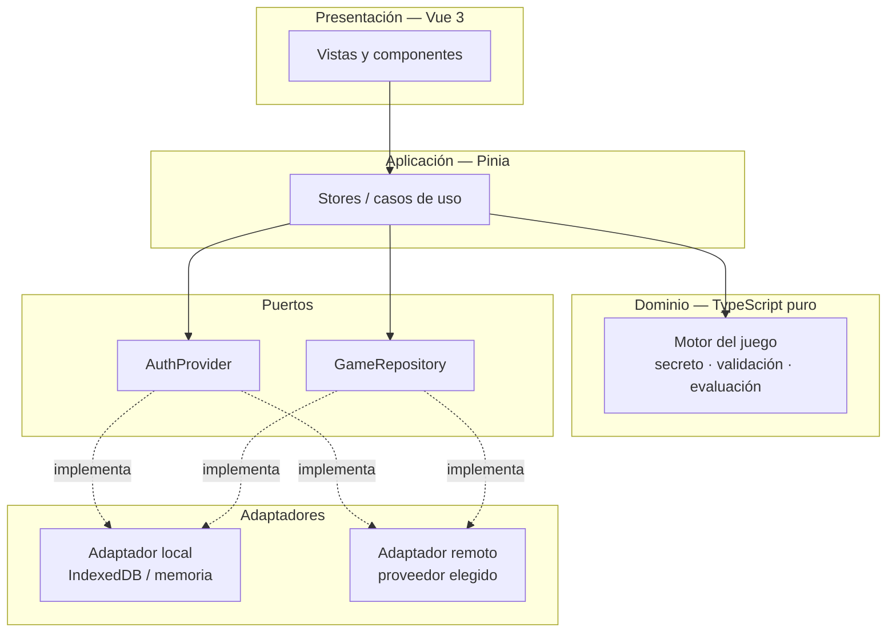

# Arquitectura target — Bulls and Cows

> Versión 1 · Basado en las decisiones D-01…D-07 del [registro de decisiones](00-registro-decisiones.md).
> Condiciones comerciales de proveedores verificadas en septiembre de 2026; conviene revalidarlas antes de comprometerse.

---

## 1. Drivers de arquitectura

Derivados de las decisiones tomadas, ordenados por peso:

| ID | Driver | Origen |
|---|---|---|
| **DR-01** | El sistema debe seguir funcionando dentro de 5 años sin reescritura. Es el fallo que motiva este trabajo. | Lección del legacy |
| **DR-02** | La elección de proveedor de persistencia e identidad debe ser **reversible**. La base de datos ya desapareció una vez. | D-03, historia del proyecto |
| **DR-03** | Coste de operación tendente a cero y esfuerzo de operación tendente a cero. | Proyecto personal |
| **DR-04** | El servidor ejecuta el dominio para las partidas clasificatorias; el cliente lo ejecuta para las casuales. **El código de dominio es el mismo en ambos.** | D-11 |
| **DR-08** | Un ranking público sólo tiene sentido si es creíble: el secreto no puede residir en el cliente durante una partida puntuable. | D-11, D-12 |
| **DR-05** | El dominio del juego debe ser aislable, testeable y libre de dependencias. | DT-03, DT-01 |
| **DR-06** | Accesibilidad y funcionamiento con teclado son requisito, no adorno. | D-04, D-06 |
| **DR-07** | La cadena de suministro debe ser auditable: lockfile, SBOM, escaneo, actualizaciones automatizadas. | SEC-04, SEC-05 |

**DR-01 y DR-02 son los que gobiernan el diseño.** La causa raíz del estado
actual no es que el código fuera malo, sino que el dominio quedó soldado a un
framework de UI abandonado y a un proveedor de datos. La arquitectura target se
organiza alrededor de evitar exactamente eso.

## 2. Arquitectura lógica

Puertos y adaptadores, en su forma mínima —  suficiente para una aplicación de
4 pantallas, sin ceremonia añadida.



### 2.1 Capas

| Capa | Contenido | Dependencias permitidas |
|---|---|---|
| **Dominio** | Motor del juego. Funciones puras, fuente de aleatoriedad inyectada. | Ninguna. Ni Vue, ni red, ni `Date.now()` directo. |
| **Aplicación** | Stores Pinia: partida en curso, sesión, histórico. Orquestan dominio + puertos. | Dominio, puertos. |
| **Puertos** | Dos interfaces TypeScript, nada más. | — |
| **Adaptadores** | Implementaciones concretas: local y remota. | SDK del proveedor. |
| **Presentación** | Vistas y componentes Vue. | Aplicación. Nunca dominio ni adaptadores. |

### 2.2 Los puertos

```ts
interface AuthProvider {
  signIn(): Promise<void>
  signOut(): Promise<void>
  currentUser(): User | null
  onAuthChange(cb: (u: User | null) => void): Unsubscribe
}

// El puerto clave. Nótese que `guess` DEVUELVE la evaluación:
// quien la calcula es el adaptador, no quien lo llama.
interface GameSession {
  start(level: Level): Promise<GameId>
  guess(id: GameId, value: string): Promise<Outcome>   // { bulls, cows, solved }
  abandon(id: GameId): Promise<void>
}

interface HistoryRepository {
  listRecent(limit: number): Promise<GameSummary[]>
  get(id: GameId): Promise<GameDetail>
}

interface Leaderboard {                                 // sólo adaptador remoto
  top(board: BoardSpec, limit: number): Promise<Entry[]>
  positionOf(playerId: PlayerId, board: BoardSpec): Promise<number | null>
}
```

**La forma de `GameSession` es lo que hace posible el ranking.** El diseño
anterior exponía `appendMove(id, {value, bulls, cows})` —  es decir, el cliente
calculaba el resultado y el servidor lo aceptaba. Esa firma es intrínsecamente
falsificable: no hay control que la salve. Al devolver `guess` la evaluación en
lugar de recibirla, el adaptador remoto se convierte en la autoridad, y el
mismo contrato sirve para los dos modos:

| Adaptador | Secreto | Evalúa | Uso |
|---|---|---|---|
| `LocalGameSession` | IndexedDB del navegador | El dominio, en el navegador | Partida casual, invitado, sin red |
| `RemoteGameSession` | D1, nunca sale del servidor | El dominio, **el mismo paquete**, en el Worker | Partida clasificatoria |

Consecuencias prácticas:

- El **adaptador local** (IndexedDB) no es un artefacto de test: es el modo
  invitado de la aplicación y el entorno de desarrollo sin red. Se implementa
  primero.
- Cambiar de proveedor es escribir un adaptador nuevo, no reescribir la
  aplicación. Esto satisface DR-02 de forma verificable, no declarativa.
- La misma batería de tests de contrato se ejecuta contra **todos** los
  adaptadores. Si el adaptador remoto pasa los mismos tests que el local, la
  sustitución es segura.
- El paquete de dominio se compila para dos destinos: navegador y
  `workerd`. Al no tener dependencias ni tocar `Date.now()` directamente, esto
  no requiere ninguna adaptación —  es la razón por la que DR-05 estaba
  formulado de forma tan estricta antes de que existiera el requisito de
  ranking.

## 3. Stack frontend

| Elemento | Elección | Justificación |
|---|---|---|
| Build | **Vite** | Estándar de facto del ecosistema Vue; sustituye webpack 2, Babel 6 y toda la carpeta `build/`. |
| Framework | **Vue 3** con `<script setup>` | Continuidad conceptual con el original; migración de conocimiento, no de código. |
| Lenguaje | **TypeScript**, `strict` | DR-05: el dominio con tipos es documentación ejecutable. Previene la clase de bug de BF-07 (nivel como string). |
| Estado | **Pinia** | Reactividad real. Elimina DT-08 y BF-13 por construcción. |
| Enrutado | **Vue Router 4** con *navigation guards* | Cierra DT-09: `/game/:level` deja de ser alcanzable sin sesión ni partida. |
| UI | **CSS propio con *custom properties*** — sin framework de componentes | **La decisión menos obvia y la más importante.** El legacy murió porque `vue-material` fue abandonado. Con 4 pantallas y ~8 componentes, un framework Material (Vuetify 3, PrimeVue) aporta poco y reintroduce exactamente el riesgo de DR-01. Se conserva la identidad visual original (`#3f51b5`, iconografía existente) mediante tokens. |
| Iconos | **SVG sprite autohospedado** | Elimina la dependencia de red de SEC-06 y el CDN de Google Fonts. |
| Tipografía | **Autohospedada** (`@font-face` local) | Idem SEC-06: sin transferencia de IP a terceros, sin dependencia externa en tiempo de ejecución. |
| i18n | **vue-i18n**, `es` + `en` | D-04. Cierra DT-18. |
| PWA | **vite-plugin-pwa** (Workbox), estrategia *precache* del shell | D-05. Cierra DT-17. |
| Tests unitarios | **Vitest** + `@vue/test-utils` | Sustituye Karma/PhantomJS (ambos muertos). |
| Tests e2e | **Playwright** | Sustituye Nightwatch/Selenium. Cubre también accesibilidad (`@axe-core/playwright`). |
| Lint/formato | **ESLint 9** (flat config) + `eslint-plugin-vue` + `typescript-eslint` + Prettier | Fuera del build: gate independiente en CI, no un loader de webpack. |

### 3.1 Qué se conserva del legacy

- `src/game/index.js` → reescrito a TypeScript puro, corregido y testeado. **Es el único código que sobrevive.**
- Paleta (`#3f51b5`), iconografía (`static/img/icons/`) y manifiesto: reutilizables tal cual.
- El diseño de interacción, como especificación — no como código.

## 4. Modelo de datos target

Expresado en relacional; trasladable a documental sin cambios conceptuales.

```sql
create table players (
  id             text primary key,      -- opaco, derivado del `sub` del proveedor
  alias          text not null unique,  -- nombre público; nunca el de Google (D-13)
  country        text,                  -- ISO 3166-1 alfa-2, autodeclarado, nullable
  ranked_opt_in  integer not null default 0,
  created_at     integer not null
);

create table games (
  id           text primary key,
  player_id    text not null references players(id) on delete cascade,
  mode         text not null,           -- 'casual' | 'ranked'      (D-11)
  level        integer not null check (level between 3 and 6),
  secret       text not null,           -- en 'ranked' NUNCA se envía al cliente
  started_at   integer not null,
  finished_at  integer,                 -- null = en curso o abandonada
  status       text not null,           -- 'in_progress' | 'won' | 'abandoned'
  attempts     integer not null default 0,
  duration_ms  integer                  -- materializado al ganar; null en otro caso
);

create table moves (
  game_id    text not null references games(id) on delete cascade,
  ordinal    integer not null,
  value      text not null,
  bulls      integer not null,
  cows       integer not null,
  created_at integer not null,
  primary key (game_id, ordinal)
);

-- Índice que sostiene D-12: mejor partida por nivel, intentos y luego tiempo.
create index idx_ranking on games (mode, level, status, attempts, duration_ms)
  where mode = 'ranked' and status = 'won';
```

`attempts` y `duration_ms` se materializan al cerrar la partida. Es
desnormalización deliberada: evita agregar sobre `moves` en cada consulta de
ranking, que es la lectura más frecuente del sistema.

Cambios respecto al modelo original y qué brecha cierran:

| Cambio | Cierra |
|---|---|
| `level` tipado como entero, no cadena | BF-07 |
| Conteo de intentos por agregación sobre `moves`, no por `.length` sobre un objeto | BF-05 |
| `finished_at` explícitamente nullable + `status` explícito; la duración se calcula *null-safe* | BF-06 |
| Clave primaria `(game_id, ordinal)` | BF-04 (imposible sobrescribir un intento) |
| **El secreto se persiste desde el inicio.** En modo `ranked` es la fuente de verdad del servidor y no se expone jamás; en `casual` se guarda al terminar y habilita revisar la partida | D-11 |
| Aislamiento por `player_id` como regla declarada **en el repositorio de código** | SEC-02, DT-05 |
| `mode` explícito por partida; sólo `ranked` alimenta las tablas | D-11, D-12 |

### 4.1 Diseño del ranking

**Tablas iniciales (D-14).** Ámbitos `global` y `country`; periodos `all-time` y
`monthly`; una por nivel. Total: 16 tablas en lanzamiento. El ámbito
`continent` se habilita cuando haya población que lo justifique —  se deriva del
país mediante una tabla estática en código, no se almacena (D-13).

**Orden (D-12):** `attempts ASC, duration_ms ASC, finished_at ASC`. El tercer
criterio desempata a favor de quien lo consiguió antes, que es la convención
menos discutible.

**Elegibilidad.** Una partida entra en las tablas si `mode = 'ranked'`,
`status = 'won'` y el jugador tiene `ranked_opt_in = 1`. Retirar el
consentimiento retira al jugador de las tablas sin borrar sus partidas.

**Caché.** Las tablas se leen mucho más de lo que se escriben. El Worker cachea
el top N por tabla en la Cache API con TTL corto (60 s). Con esto, el coste en
lecturas de D1 deja de crecer con el tráfico y pasa a depender sólo del número
de tablas —  relevante para no rozar la cuota (§6.4).

**Anti-abuso del modo clasificatorio (D-15 y siguientes).** Ninguna medida es
definitiva; el objetivo es elevar el coste, no cerrar la puerta:

| Medida | Qué ataca |
|---|---|
| Secreto y evaluación en servidor | Falsificación directa del resultado. Es la medida que importa. |
| Tiempo mínimo plausible entre intentos | Automatización burda. |
| Límite de partidas clasificatorias por jugador y día | Fuerza bruta por repetición hasta lograr una partida afortunada. |
| Turnstile al crear partida clasificatoria | Creación masiva automatizada. |
| Tablas mensuales además de históricas | Limita la permanencia del daño: una entrada fraudulenta caduca. |

**Techo reconocido.** Bulls & Cows es resoluble programáticamente en 5-6
intentos. Con el secreto en servidor, hacer trampa deja de ser abrir la consola
y pasa a ser escribir un *solver* que además simule tiempos humanos. Para un
juego de este tamaño es suficiente, pero conviene tenerlo escrito: **la tabla
histórica de nivel 3 es la más vulnerable** —  el espacio de soluciones es
pequeño y el margen entre juego óptimo humano y automatizado, estrecho.

## 5. Seguridad y cumplimiento

| Control | Implementación | Cierra |
|---|---|---|
| Reglas de autorización en control de versiones | Migraciones SQL con RLS (o reglas del proveedor) versionadas en `infra/` | SEC-02, DT-05 |
| Lockfile versionado | Eliminar `package-lock.json` de `.gitignore` | SEC-04, DT-04 |
| SBOM | CycloneDX generado en cada build y adjunto a la release | SEC-05, DR-07 |
| SCA | `npm audit` + OSV-Scanner en CI; Renovate para actualizaciones automatizadas | SEC-05 |
| CSP y cabeceras | `Content-Security-Policy`, `X-Content-Type-Options`, `Referrer-Policy`, `Permissions-Policy` como configuración de hosting versionada | SEC-07 |
| Sin recursos de terceros | Fuentes e iconos autohospedados | SEC-06 |
| Source maps | Generados pero **no publicados**; subidos al capturador de errores | SEC-08 |
| Login explícito | Botón "Entrar con Google" — nunca popup automático al cargar | SEC-09 |
| Cierre de sesión y borrado de cuenta | Ambos en la interfaz; el borrado elimina en cascada las partidas | SEC-10, BF-09 |
| Sin filtración del secreto | Prohibido `console.log` en dominio; regla ESLint `no-console` como error | SEC-03, BF-01, DT-07 |

## 6. Opciones de infraestructura

Requisitos que debe cubrir el proveedor, dados D-01, D-02 y D-07: **hosting
estático con fallback SPA y cabeceras personalizables**, **identidad con Google
OAuth** y **persistencia aislada por usuario**. Nada más: no hay lógica de
servidor.

Volumen esperado: decenas de filas por partida, unos pocos MB en total. El
volumen **no es un criterio discriminante**; sí lo son la continuidad, el
esfuerzo y el bloqueo.

### 6.1 Comparativa

| | **A. Firebase moderno** | **B. Supabase** | **C. Cloudflare** | **D. Azure SWA** | **E. PocketBase autohospedado** |
|---|---|---|---|---|---|
| **Hosting** | Firebase Hosting | Cloudflare Pages / Netlify | Cloudflare Pages | Static Web Apps | Cloudflare Pages o el propio binario |
| **Identidad** | Firebase Auth (Google incluido) | Supabase Auth (Google incluido) | **A construir**: Worker con OAuth, o IdP externo | Easy Auth — **requiere plan Standard** | **Incluida**: OAuth2 Google nativo |
| **Datos** | Firestore | Postgres + RLS | D1 (SQLite) | Cosmos DB / Table Storage | SQLite embebido |
| **Coste** | 0 (plan Spark) | 0 (plan Free) | 0 (plan Free) | **~9 USD/mes** (Standard) | 0 en infra; consumo eléctrico |
| **Continuidad del servicio** | Estable | ⚠️ **Los proyectos Free se pausan tras 1 semana de inactividad** | Sin pausas | Estable | Depende del propio servidor |
| **Esfuerzo de implementación** | **Bajo** | Bajo | **Alto** (identidad propia) | Medio | Bajo |
| **Esfuerzo de operación** | Nulo | Nulo (salvo despausar) | Nulo | Nulo | **Medio**: parches, backups, disponibilidad |
| **Bloqueo de proveedor** | **Alto** (Firestore, reglas propietarias) | Bajo (Postgres estándar, autohospedable) | Medio (D1 = SQLite, portable; Workers no) | Alto | **Nulo** |
| **Riesgo DR-01 a 5 años** | Medio — el SDK ya rompió compatibilidad una vez (v8→v9) | Bajo | Bajo | Medio | Bajo — SQLite y un binario Go |

Límites relevantes de los planes gratuitos, verificados en septiembre de 2026:

- **Supabase Free**: 500 MB de base de datos, 50 000 MAU, 5 GB de egress, 2 proyectos activos, y **pausa tras una semana de inactividad**.
- **Cloudflare D1 Free**: 5 millones de filas leídas/día, 100 000 escritas/día, 5 GB de almacenamiento total. Desde el 1 de septiembre de 2026 estos límites se **aplican efectivamente** (antes no se hacían cumplir).
- **Azure Static Web Apps**: la autenticación con proveedores personalizados (Google entre ellos) **no está disponible en el plan Free**.

### 6.2 Lectura de la comparativa

**Supabase (B) es la opción técnicamente más limpia y la que peor encaja con
este caso concreto.** Postgres estándar, RLS declarativa, autohospedable,
excelente ergonomía. Pero un juego personal se usa de forma intermitente, y la
pausa por inactividad semanal significa encontrarse la aplicación caída
justamente al volver a ella —  que es, literalmente, el modo de fallo que
estamos corrigiendo. Los *workarounds* habituales (un cron que hace ping) son
precisamente el tipo de parche que no debería estar en una arquitectura target.

**Azure (D) queda descartada por coste**: es la única opción que no es gratuita,
y lo es por el requisito de identidad, que es innegociable (D-01). Su valor
sería la transferencia de conocimiento al entorno corporativo, no el proyecto.

**Firebase (A) es la de menor esfuerzo** y la tentación obvia: recrear el
proyecto y actualizar el SDK a la API modular. Pero reincide en el bloqueo que
ya costó una migración, y el corte v8→v9 demuestra que tampoco es estable a
largo plazo.

**Cloudflare (C) es la opción gestionada más sólida** en continuidad, coste y
portabilidad —  a cambio de construir la identidad, que es la única pieza que no
regala. Un Worker que implemente el flujo OAuth de Google y emita una sesión
firmada son ~150 líneas; alternativamente, un IdP gestionado externo.

**PocketBase autohospedado (E) es el mejor encaje funcional**: identidad Google
nativa, SQLite, reglas por colección, SDK ligero, un único binario Go, bloqueo
nulo y coste nulo. Aprovecha el MiniPC y el stack de observabilidad ya
existentes. El precio es que la disponibilidad del servicio pasa a ser
responsabilidad propia —  luz, red, disco y backups.

### 6.3 Decisión

**Cloudflare Pages + Workers + D1** (D-09), tras cerrarse P-01 con **D-08: el
juego es público**.

El carácter público descarta el autohospedaje doméstico como infraestructura de
producción: la disponibilidad de un servicio abierto no debe depender de una
conexión residencial, y una IP doméstica expuesta a tráfico no controlado es una
superficie que no compensa en un proyecto personal. PocketBase sigue siendo
excelente —  pero para un entorno de desarrollo o una instancia privada, no para
la producción pública.

**Corrección al esfuerzo estimado en la matriz.** La comparativa marcaba
Cloudflare como "esfuerzo alto" por tener que construir la identidad. Es
engañoso: **D1 sólo es accesible desde un Worker**, de modo que el Worker existe
de todas formas como API de persistencia. Añadir a ese mismo Worker los tres
endpoints del flujo OAuth (`/auth/login`, `/auth/callback`, `/auth/logout`) es
un incremento marginal, no una pieza nueva de infraestructura. El esfuerzo real
es **medio**, y se concentra en una sola fase acotada.

Diseño de la identidad:

- *Authorization Code Flow* con PKCE contra Google. El `client_secret` vive como
  *secret* del Worker; nunca llega al navegador.
- El Worker emite una **cookie de sesión propia**, `HttpOnly`, `Secure`,
  `SameSite=Lax`, firmada con HMAC vía Web Crypto. Sin tokens en
  `localStorage`.
- Se solicita únicamente el ámbito `openid` (y `profile` si se quiere nombre
  para mostrar). **No se solicita `email`** (D-10): el identificador de usuario
  es el `sub` del proveedor, opaco y suficiente.
- Cookie estrictamente necesaria → no requiere banner de consentimiento. Al no
  haber recursos de terceros ni analítica, la aplicación no necesita gestor de
  consentimiento en absoluto.

**Firebase sigue siendo el atajo pragmático** —  menos código, todo resuelto.
Se descarta conscientemente: reincide en el bloqueo que ya obligó a esta
migración, y el objetivo declarado (DR-01, DR-02) pesa más que ahorrar una fase.

### 6.4 Consecuencias de ser un servicio público

| Ámbito | Implicación | Fase |
|---|---|---|
| **RGPD** | Aviso de privacidad y términos de uso publicados. Derecho de supresión operativo (borrado de cuenta con cascada). Minimización: sin correo electrónico almacenado (D-10). Responsable del tratamiento identificable. El **país es dato personal**: autodeclarado (D-15), opcional, modificable y borrable. La aparición en tablas públicas es **opt-in** revocable (D-13). | F5, F7 |
| **Abuso y disponibilidad** | El plan gratuito de D1 permite **100 000 filas escritas al día para toda la cuenta**. Un único actor malicioso podría agotarlo y dejar el servicio caído para todos. Es el riesgo de disponibilidad más serio del diseño. Mitigación: límite de tasa por sesión y por IP en el Worker, cota de partidas clasificatorias por jugador y día, y Turnstile en el endpoint de creación. | F3, F5 |
| **Integridad del ranking** | Resuelta por diseño: en modo clasificatorio el secreto vive en el servidor y el cliente nunca lo ve (D-11). El modo casual sigue siendo falsificable y **por eso no puntúa**. Ver §4.1 para el techo real de esta protección. | F3, F7 |
| **Alias públicos** | Un alias elegido y visible en una web abierta implica moderación: filtro de términos, prohibición de suplantación y un mecanismo de reporte. | F7 |
| **Umbral de coste** | Una partida casual consume del orden de 10-30 escrituras, concentradas al final. Una **clasificatoria escribe en cada intento**, lo que multiplica la presión sobre la cuota. Con la caché de tablas (§4.1) las lecturas están acotadas; las escrituras son el recurso a vigilar. Alerta antes de rozar el límite. | F5 |
| **Soporte y continuidad** | Publicar implica un compromiso implícito de permanencia. La exportación de datos del usuario (JSON) y el backup programado de D1 dejan de ser opcionales. | F5 |

### 6.5 Reversibilidad

Sea cual sea el proveedor, **el primer adaptador que se implementa es el local
(IndexedDB)**. La aplicación debe ser completamente funcional en modo invitado
antes de que exista backend alguno. Esto tiene tres efectos:

1. Convierte la decisión de infraestructura en reversible **de hecho**: si el
   proveedor desaparece, se escribe un adaptador y se pasan los tests de
   contrato.
2. Permite publicar un producto útil al final de F2, antes de escribir una sola
   línea de servidor.
3. Da un modo de juego sin registro, que para un servicio público es además la
   vía de entrada natural: se juega primero, se crea cuenta sólo si se quiere
   conservar el histórico.

## 7. Calidad y entrega

### 7.1 Estrategia de pruebas

| Nivel | Herramienta | Alcance | Umbral |
|---|---|---|---|
| Unitario — dominio | Vitest | Motor del juego con RNG inyectado: generación, validación, evaluación, casos límite (dígito `0` inicial, nivel 6, intento ganador) | **≥ 95 %** |
| Unitario — aplicación | Vitest | Stores con adaptador en memoria | ≥ 80 % |
| Contrato — adaptadores | Vitest | **La misma suite contra todos los adaptadores** | 100 % de los métodos del puerto |
| Componente | Vitest + Test Utils | Componentes de entrada y lista de intentos | — |
| E2E | Playwright | Recorridos: login, partida completa, histórico, cierre de sesión | Los 4 recorridos |
| Accesibilidad | `@axe-core/playwright` | Las 4 pantallas | 0 violaciones críticas |

### 7.2 Pipeline

```
push / PR
  ├── lint + format
  ├── typecheck
  ├── test:unit  (gate de cobertura)
  ├── test:contract
  ├── build
  ├── test:e2e + a11y  (sobre el build)
  ├── SCA (npm audit + OSV) + SBOM (CycloneDX)
  └── deploy preview
main
  └── deploy producción + publicación de SBOM
```

Cierra DT-06 y SEC-05. Renovate para actualizaciones automatizadas —  el control
que evita que esto vuelva a ocurrir.

### 7.3 Observabilidad

Mínima y proporcionada: captura de errores de cliente (Sentry free o
autohospedado, consistente con el stack existente) y métricas web básicas. Sin
analítica de terceros.

## 8. Cambios funcionales que introduce el target

Para que quede explícito qué es corrección y qué es alcance nuevo:

| Nuevo | Origen |
|---|---|
| Modo invitado sin cuenta (adaptador local) | Consecuencia del diseño, no pedido |
| Entrada numérica directa por teclado | D-06 |
| Pantalla de reglas del juego | BF-11 |
| Cierre de sesión y borrado de cuenta | BF-09, SEC-10 |
| Interfaz en español e inglés | D-04 |
| Instalable, arranque offline | D-05 |
| Persistencia del secreto y revisión de partida | Modelo de datos §4 |
| Layout de escritorio | D-05 |
| **Modo clasificatorio** validado en servidor, distinto del casual | D-11 |
| **Tablas de clasificación** global y por país, histórica y mensual, por nivel | D-12, D-14 |
| **Onboarding de perfil**: alias público y país opcional | D-13 |
| Moderación de alias y mecanismo de reporte | D-13 |

## 9. Siguiente documento

[`04-plan-de-migracion.md`](04-plan-de-migracion.md): fases, entregables,
criterios de aceptación y trazabilidad contra las brechas y la deuda técnica.

---

## Fuentes

- [Pricing & Fees — Supabase](https://supabase.com/pricing)
- [D1 enforces free tier daily query limits — Cloudflare Changelog](https://developers.cloudflare.com/changelog/post/2026-09-01-d1-free-tier-limit-enforcement/)
- [D1 Pricing — Cloudflare Docs](https://developers.cloudflare.com/d1/platform/pricing/)
- [Custom authentication in Azure Static Web Apps — Microsoft Learn](https://learn.microsoft.com/en-us/azure/static-web-apps/authentication-custom)
