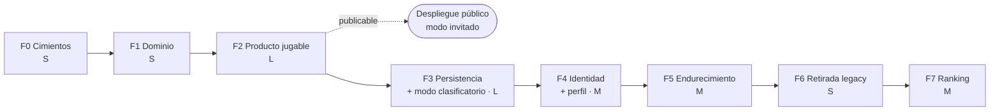

# Plan de migración — Bulls and Cows

> Versión 1 · Deriva de las decisiones D-01…D-10 y de la
> [arquitectura target](03-arquitectura-target.md).

---

## 1. Estrategia

**Reconstrucción con dominio heredado, no migración incremental.**

La razón es concreta y está documentada en el levantamiento: `vue-material` no
tiene ruta de migración a Vue 3, y constituye ~70 % del marcado. Cualquier
intento de actualización progresiva obliga a sustituir la capa de UI de todos
modos, con el coste añadido de mantener dos mundos conviviendo. El único
artefacto que sobrevive —  el motor del juego —  son 80 líneas.

La reconstrucción se hace **en el mismo repositorio**, sobre una rama nueva, con
la historia intacta y el código original preservado bajo un tag. No se empieza
un repositorio nuevo: la trazabilidad del cambio es parte del valor.

### Principio ordenador de las fases

Cada fase termina en un **estado desplegable y verificable**. En particular,
**F2 produce un producto público útil** —  jugable, accesible, instalable, sin
cuenta —  antes de que exista una sola línea de servidor. Todo lo que viene
después añade persistencia sincronizada, no jugabilidad.

Esto tiene una consecuencia práctica: si el proyecto se detiene en F2, lo
entregado sigue siendo un producto completo, no un esqueleto.

## 2. Fases

### F0 — Cimientos

Establecer la cadena de construcción y los controles de calidad **antes** de
escribir código de producto. Es el error que se paga en el legacy: el
*scaffolding* nunca se tocó y los tests nunca funcionaron.

**Entregables**

- Rama nueva; tag `legacy/v1.0.0-alpha` sobre el estado actual.
- Esqueleto Vite + Vue 3 + TypeScript `strict`.
- ESLint 9 (flat config) + `eslint-plugin-vue` + `typescript-eslint` + Prettier.
  Regla `no-console` como **error**.
- Vitest y Playwright configurados y ejecutándose sobre un caso trivial.
- `package-lock.json` **fuera de `.gitignore`** y versionado.
- Pipeline de CI: lint → typecheck → test → build.
- `.nvmrc`, licencia, `README.md` real.

**Criterios de aceptación**

- Pipeline en verde sobre un componente vacío.
- `npm ci` reproducible desde cero en la versión de Node fijada.
- Un `console.log` en el código hace fallar la CI.

*Cierra:* DT-04, DT-15, parte de DT-06, SEC-04.
*Tamaño:* S.

> **Estado: entregado (2026-09-11).** Verificado en contenedor: `pnpm check`
> en verde, e2e en verde, un `console.log` rompe lint, `domain` no puede
> importar dependencias no declaradas, `pnpm install --frozen-lockfile`
> reproducible. Versiones resueltas: Vue 3.5, Vite 8, Vitest 5, ESLint 10,
> TypeScript 6.0 (fijado; ver D-17), Wrangler 4, Zod 4, Playwright 1.63.
> Pendiente de ejecutar en local: `scripts/f0-migrate.sh` (tag, rama, borrado
> del legacy, commit).

---

### F1 — Dominio

Portar y corregir el motor del juego. Es la pieza de mayor valor y la de menor
riesgo: lógica pura, sin UI, sin red.

**Entregables**

- `src/domain/` en TypeScript puro, **sin ninguna dependencia** —  ni Vue, ni
  red, ni acceso directo al reloj.
- Fuente de aleatoriedad inyectada, para poder fijar secretos en los tests.
- Tipos de dominio: `Level` (3|4|5|6), `Secret`, `Guess`, `Evaluation`.
- Correcciones: eliminación del `console.log` del secreto, validación de
  longitud además de repetición, imposibilidad de intentos con ordinal
  duplicado.
- Batería de pruebas con casos límite: secreto con `0` inicial, nivel 6,
  intento ganador, intento vacío, intento con repetidos, todos los dígitos
  presentes en posición incorrecta.

**Criterios de aceptación**

- Cobertura del dominio **≥ 95 %**.
- El paquete de dominio compila y se testea **sin instalar Vue**.
- Un test que fija el RNG produce partidas deterministas y reproducibles.

*Cierra:* BF-01, BF-03, BF-04, DT-03 (parcial), DT-07, SEC-03 (la filtración).
*Tamaño:* S.

> **Estado: entregado (2026-09-11).** `packages/domain/src/{level,random,secret,guess,evaluate,game}.ts`.
> 39 tests de dominio (44 en total), cobertura del dominio 100 % en líneas,
> ramas y funciones; umbral 95 % fijado en `vitest.config.ts`. Verificado que
> el paquete compila aislado sin `node_modules` propios. API: `generateSecret`,
> `validateGuess`, `evaluate`, `isSolved`, `startGame`, `play`,
> `createSeededRandom`; estado inmutable, sin reloj, aleatoriedad inyectada.
> Secreto por Fisher-Yates parcial (equiprobable, sin reintentos); cows por
> intersección de conjuntos, con simetría verificada por propiedad.

---

### F2 — Producto jugable, sin backend

La fase más grande y la que entrega valor público. Aplicación completa contra el
**adaptador local (IndexedDB)**.

**Entregables**

- Puertos `AuthProvider`, `GameSession`, `HistoryRepository` y `Leaderboard`
  definidos.
- Adaptador local de `GameSession` e `HistoryRepository`: IndexedDB, sesión
  anónima local.
- Stores Pinia: sesión, partida en curso, histórico.
- Router con *guards*: `/game/:level` inaccesible sin partida creada.
- Pantallas: inicio, configuración, juego, puntuación, **reglas del juego**,
  ajustes.
- **Entrada numérica directa** (teclado físico y numérico del sistema) con los
  selectores `+/−` como modo táctil alternativo.
- Sistema de diseño propio: *custom properties*, conservando `#3f51b5`.
- Iconos como sprite SVG autohospedado; tipografía autohospedada.
- i18n `es` + `en`.
- Layout responsive móvil + escritorio.
- PWA: manifiesto revisado + service worker con precache del shell.

**Criterios de aceptación**

- Partida completa jugable **sin red y sin cuenta**.
- Recorrido e2e completo en Playwright.
- `@axe-core/playwright`: **0 violaciones críticas** en las seis pantallas.
- Partida completa jugable **sólo con teclado**, foco visible en todo momento.
- Lighthouse: PWA instalable; rendimiento ≥ 95 en móvil.
- Cambio de idioma sin recarga; ninguna cadena embebida en plantillas.

*Cierra:* BF-02, BF-05…BF-08, BF-10…BF-13, DT-08, DT-09, DT-10, DT-11, DT-16,
DT-17, DT-18, SEC-06.
*Tamaño:* L. **Es la fase dominante del proyecto.**

> **Hito publicable.** Al cerrar F2 el juego puede publicarse en Cloudflare
> Pages como producto autónomo. Merece la pena hacerlo: valida el despliegue y
> el rendimiento reales mucho antes de que haya backend que depurar.

---

### F3 — Persistencia remota

**Entregables**

- Worker con API REST: `POST /games`, `POST /games/:id/guesses`,
  `POST /games/:id/abandon`, `GET /games`.
- **El paquete de dominio se ejecuta dentro del Worker** (D-11): el endpoint de
  intento recibe un valor y **devuelve** la evaluación; nunca la acepta del
  cliente.
- Esquema D1 con **migraciones versionadas** en `infra/`, incluyendo `mode` y el
  índice de ranking.
- Adaptadores remotos de `GameSession` y `HistoryRepository`.
- **Tests de contrato**: la misma suite ejecutada contra los adaptadores local y
  remoto de `GameSession`.
- Límite de tasa por sesión y por IP; cota de partidas clasificatorias por
  jugador y día; tiempo mínimo plausible entre intentos.

**Criterios de aceptación**

- El adaptador remoto pasa **exactamente los mismos tests** que el local.
- Cambiar de adaptador es una variable de entorno, sin tocar stores ni vistas.
- **El secreto de una partida `ranked` no aparece en ninguna respuesta de la
  API.** Verificado con un test que inspecciona todos los cuerpos de respuesta
  de una partida completa.
- Un cliente que envía `bulls`/`cows` en el cuerpo de un intento recibe `400`:
  el campo no existe en el contrato.
- Las migraciones se aplican desde cero sobre una base vacía.
- Un cliente que supera el límite de tasa recibe `429`, presentado de forma
  legible.

*Cierra:* DT-13, DT-05 (esquema y reglas versionados), DR-08, riesgo de
agotamiento de cuota de D-08.
*Tamaño:* M → **L**, por la lógica de partida en servidor.

---

### F4 — Identidad

**Entregables**

- Endpoints `/auth/login`, `/auth/callback`, `/auth/logout` en el Worker.
- *Authorization Code Flow* con PKCE contra Google; `client_secret` como secret
  del Worker.
- Cookie de sesión propia: `HttpOnly`, `Secure`, `SameSite=Lax`, firmada HMAC.
- Ámbitos mínimos: `openid` (+ `profile` si se quiere nombre). **Sin `email`**
  (D-10).
- Adaptador `AuthProvider` remoto; guards de router.
- **Login explícito por botón** —  nunca automático al cargar.
- Cierre de sesión y **borrado de cuenta** con cascada.
- Promoción del histórico local al remoto al iniciar sesión por primera vez.
- **Onboarding de perfil** (D-13): alias obligatorio y único, país opcional
  autodeclarado, casilla de participación en el ranking. Pantalla de perfil para
  modificar los tres.

**Criterios de aceptación**

- Recorrido e2e: invitado → jugar → iniciar sesión → alias → histórico promovido
  → cerrar sesión → el histórico local persiste.
- Ningún token en `localStorage` ni accesible desde JavaScript.
- Borrar la cuenta elimina todas las partidas y el usuario; verificado en base
  de datos.
- El `email` ni el nombre real del proveedor aparecen en ninguna tabla, log ni
  respuesta de la API.
- Un alias duplicado se rechaza con un mensaje claro, sin revelar de quién es.

*Cierra:* BF-09, SEC-09, SEC-10, DT-09 (completo).
*Tamaño:* M.

---

### F5 — Endurecimiento y salida a producción

**Entregables**

- Cabeceras versionadas: CSP, `X-Content-Type-Options`, `Referrer-Policy`,
  `Permissions-Policy`, HSTS.
- Source maps generados pero **no publicados**; subidos al capturador de
  errores.
- SBOM CycloneDX por build, adjunto a la release.
- SCA en CI (`npm audit` + OSV-Scanner) y Renovate para actualizaciones
  automatizadas.
- Captura de errores de cliente.
- Aviso de privacidad y términos de uso publicados.
- Exportación de datos del usuario en JSON.
- Backup programado de D1 y prueba de restauración.
- Alerta de consumo antes de rozar los límites del plan gratuito.
- Dominio propio (P-04).

**Criterios de aceptación**

- La CSP no requiere `unsafe-inline` ni `unsafe-eval`.
- `securityheaders.com` con calificación A o superior.
- Una vulnerabilidad crítica introducida deliberadamente hace fallar la CI.
- **Restauración de un backup verificada de extremo a extremo**, no sólo
  programada.

*Cierra:* SEC-01, SEC-05, SEC-07, SEC-08, DT-06 (completo), obligaciones de
D-08.
*Tamaño:* M.

---

### F6 — Retirada del legacy

**Entregables**

- Corte de tráfico al nuevo hosting.
- Despublicación de Firebase Hosting y cierre del proyecto Firebase.
- Rotación o revocación de las credenciales expuestas en el histórico de git.
- Release etiquetada `v2.0.0`.
- Documentación final: `docs/` actualizado con lo realmente construido.

**Criterios de aceptación**

- El proyecto Firebase original ya no existe ni tiene credenciales activas.
- La documentación describe el sistema construido, no el planeado.

*Cierra:* SEC-01 (definitivo), DT-01, DT-02.
*Tamaño:* S.

---

### F7 — Ranking y tablas de clasificación

Incremento de producto posterior a la migración. La arquitectura de F3 y F4 ya
lo soporta: el modo clasificatorio existe desde F3 y el perfil desde F4. Esta
fase construye lo que falta —  las tablas, su presentación y la moderación.

**Entregables**

- Puerto `Leaderboard` y su adaptador remoto.
- Endpoints `GET /leaderboards/:board` y `GET /me/positions`.
- 16 tablas iniciales (D-14): ámbitos global y país × periodos histórico y
  mensual × 4 niveles.
- Caché en Cache API con TTL de 60 s por tabla.
- Vista de clasificación con selector de nivel, ámbito y periodo, y resalte de
  la posición propia.
- Al ganar una partida clasificatoria, comparativa contra la mejor marca propia
  y la posición alcanzada.
- Moderación de alias: filtro de términos, prohibición de suplantación,
  mecanismo de reporte (P-06).
- Tarea programada de cierre y archivo de la tabla mensual (P-07).
- Aviso de privacidad actualizado: publicación de alias y país, opt-in
  revocable.

**Criterios de aceptación**

- Una partida `casual` **nunca** aparece en ninguna tabla, ni siquiera con
  `ranked_opt_in = 1`.
- Retirar el consentimiento saca al jugador de todas las tablas en la siguiente
  invalidación de caché, sin borrar sus partidas.
- Un jugador sin país aparece en la tabla global y en ninguna de país.
- La consulta de una tabla con 10 000 partidas se resuelve con el índice, sin
  escaneo completo.
- Un intento de registrar un alias en la lista de bloqueo se rechaza.
- La tabla mensual se cierra y archiva correctamente en el cambio de mes,
  verificado con reloj simulado.

*Cierra:* D-12, D-13, D-14; obligaciones de moderación de D-08.
*Tamaño:* M.

> **Orden.** F7 va después de F6 porque el ranking es valor añadido sobre un
> producto que ya debe estar en producción y endurecido. Si se prefiere lanzar
> con ranking desde el primer día, F7 se adelanta por delante de F6 sin ningún
> cambio de diseño —  la retirada del legacy es independiente.

## 3. Trazabilidad

Cada hallazgo del levantamiento, asignado a una fase. Sirve de lista de
verificación al cerrar cada una.

| Fase | Brechas funcionales | Deuda técnica | Seguridad |
|---|---|---|---|
| **F0** | — | DT-04, DT-15 | SEC-04 |
| **F1** | BF-01, BF-03, BF-04 | DT-03¹, DT-07, DT-14 | SEC-03¹ |
| **F2** | BF-02, BF-05, BF-06, BF-07, BF-08, BF-10, BF-11, BF-12, BF-13 | DT-08, DT-10, DT-11, DT-12, DT-16, DT-17, DT-18 | SEC-06 |
| **F3** | — | DT-05¹, DT-13 | — |
| **F4** | BF-09 | DT-09 | SEC-09, SEC-10 |
| **F5** | — | DT-06 | SEC-01¹, SEC-05, SEC-07, SEC-08 |
| **F6** | — | DT-01, DT-02 | SEC-01 |
| **F7** | — | — | Moderación y opt-in (D-08, D-13) |

¹ cierre parcial; se completa en una fase posterior.

**Cobertura: 13/13 brechas funcionales, 18/18 puntos de deuda técnica, 10/10
hallazgos de seguridad.** Ninguno queda sin fase asignada. F7 no cierra deuda
heredada: es producto nuevo.

## 4. Riesgos del plan

| Riesgo | Probabilidad | Impacto | Mitigación |
|---|---|---|---|
| **F2 se desborda.** Es la fase grande, y el sistema de diseño propio más accesibilidad más i18n es donde se acumula el trabajo invisible. | Alta | Alto | Trocear F2 en sub-hitos desplegables (juego sin estilo → sistema de diseño → i18n → PWA). No empezar F3 con F2 a medias. |
| **La identidad propia se subestima.** OAuth es estándar, pero el manejo de sesión, CSRF y rotación es donde aparecen los detalles. | Media | Medio | Acotar F4 estrictamente a Google. El puerto `AuthProvider` permite sustituir por un IdP gestionado sin tocar la aplicación si se atasca. |
| **Abandono tras F2.** Riesgo real en un proyecto personal. | Media | Bajo | Es el motivo de que F2 sea publicable: el abandono deja un producto, no un esqueleto. |
| **Cambio de condiciones del plan gratuito.** Los límites de D1 ya se endurecieron en septiembre de 2026. | Media | Medio | Alerta de consumo (F5) y arquitectura de adaptadores, que hace la sustitución barata. |
| **Deriva de alcance.** "Todas las mejoras" (D-04) es un alcance amplio para un proyecto personal, y el ranking lo ha ampliado. | Alta | Medio | El registro de decisiones es el contrato. Todo lo no listado en D-01…D-15 es fase posterior, no ampliación silenciosa. |
| **Tablas vacías en el lanzamiento.** Con pocos jugadores, la mayoría de las 16 tablas tendrá cero o una entrada, lo que resta credibilidad al producto. | **Alta** | Medio | Mostrar una tabla sólo a partir de un mínimo de participantes; en su defecto, presentar la marca personal. Abrir ámbitos adicionales según crezca la población (D-14). |
| **Sobrecoste de F3.** Pasar la lógica de partida al servidor convierte F3 de M a L y añade estado de partida al Worker. | Media | Medio | El dominio ya está construido y probado en F1; F3 sólo lo orquesta. Los tests de contrato detectan la divergencia entre modos. |

## 5. Secuencia recomendada

F0 y F1 son cortas y desbloquean todo lo demás; conviene encadenarlas sin pausa.
El punto de decisión real está al final de F2.

El dominio construido en F1 se ejecuta en tres sitios —  navegador, Worker y
tests —  sin ninguna adaptación. Esa es la razón de que F1 exija ausencia total
de dependencias y aleatoriedad inyectada, y lo que hace que el modo
clasificatorio de F3 sea orquestación y no una segunda implementación del juego.

## 6. Arranque

Lo primero, y no es código: **F0 sobre el repositorio actual**. Tag del estado
legacy, rama nueva, esqueleto, y una CI que falle por un `console.log`. A partir
de ahí, F1 es una tarde.
